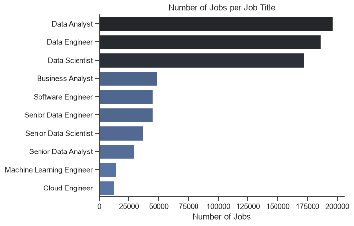
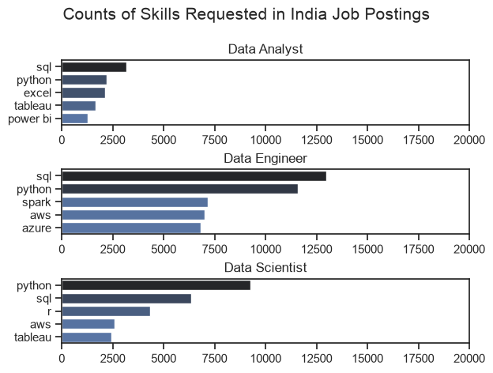
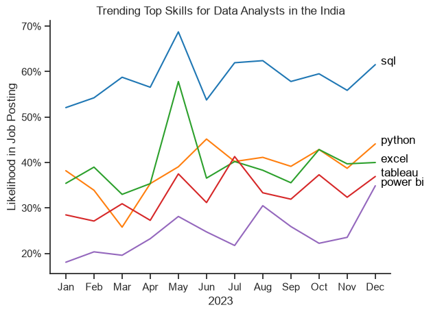
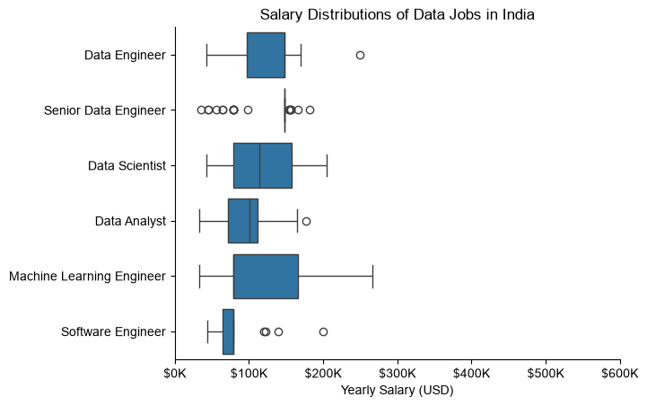
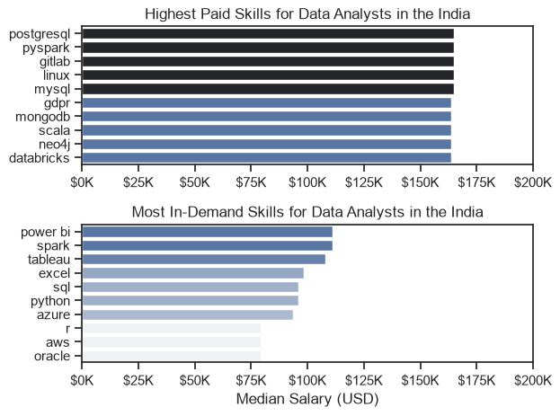
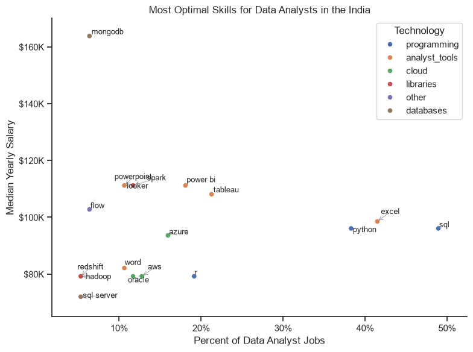

# Job & Skills Demand Analysis

## Overview

This project explores the data job market through a set of Jupyter notebooks focused on job demand, salary patterns, skill trends, and the most valuable skills for data analysts to learn.

It uses a real job-postings dataset to answer practical questions such as which roles are most common, which skills are most in demand, which skills are linked to stronger salaries, and what the best skill is to learn if you want both demand and pay.

## The Questions

1. What are the top 3 most common data job roles?
2. Which skills are most in demand for those roles?
3. How are in-demand skills trending over time for Data Analysts?
4. How well do jobs and skills pay for Data Analysts?
5. What are the optimal skills to learn (high demand AND high pay)?

## Tools I Used

- **Python** — core language for the analysis
  - **Pandas** — data manipulation
  - **Matplotlib** — visualization
  - **Seaborn** — advanced visualization
  - **adjustText** — cleaner scatter-plot labels
- **Jupyter Notebook** — running the analysis with inline notes
- **Visual Studio Code** — writing and executing the notebooks
- **Git & GitHub** — version control and sharing

## Dataset

The dataset file `data/data_jobs.csv` is not uploaded to GitHub because of file-size limits.

To run the notebooks locally, place the CSV in the `data/` folder at this path:

`data/data_jobs.csv`

You can download the data folder here:

https://www.mediafire.com/file/qhc56tq90ljw99z/data_jobs.csv/file   

If you move the notebooks into another folder, update the relative paths in the loading cells.

## Notebook Guide

| Notebook | Focus |
| --- | --- |
| `Analysis/EDA_Intro.ipynb` | General exploratory analysis across the dataset |
| `Analysis/Skills_Demand.ipynb` | Skill demand across the top 3 data roles |
| `Analysis/Skills_Trend.ipynb` | Trending skills over time for Data Analysts |
| `Analysis/Salary_Analysis.ipynb` | Salary comparisons by role and skill |
| `Analysis/Optimal_Skill.ipynb` | Best skill to learn based on demand and salary |

## The Analysis

### 1. Top Job Roles
 

*Most common data job roles by posting volume.*

**Insights:**
- Data Analyst, Data Scientist, and Data Engineer are the most frequently posted data roles.
- Each role draws on a distinct core skill set, setting up the skill-demand comparison in the next notebook.

### 2. Skill Demand for Top Roles

*Top skills requested for the top 3 most common data job roles.*

**Insights:**
- SQL leads demand for Data Analyst and Data Scientist roles.
- Python leads demand for Data Engineer roles.
- Data Engineers lean on specialized infra skills (AWS, Azure, Spark); Analysts and Scientists lean on general tools (Excel, Tableau).

### 3. Trending Skills for Data Analysts

*Monthly trend of top skills requested in Data Analyst postings.*

**Insights:**
- SQL stays the most consistently requested skill, with a slow decline over the year.
- Excel rises sharply toward year-end, overtaking Python and Tableau.
- Python and Tableau hold steady; Power BI trends up slightly late in the year.

### 4. Salary Analysis

*Salary distribution across the top data job titles.*

*Highest-paid vs. most in-demand skills for Data Analysts.*

**Insights:**
- Senior roles command higher salaries and wider salary ranges than entry-level roles.
- Specialized skills (e.g., niche database/engineering tools) pay the most but appear less often.
- Foundational skills (Excel, SQL) are the most in-demand but don't top the pay scale — showing a gap between what's common and what's most rewarded.

### 5. Most Optimal Skills to Learn

*Skills plotted by demand (%) vs. median salary, colored by technology category.*

**Insights:**
- A few specialized skills combine high pay with moderate demand — the sweet spot for upskilling.
- Programming skills cluster at higher salary levels than other categories.
- Database and analyst-tool skills (e.g., Tableau, Power BI) balance solid demand with competitive pay.

## What I Learned

- **Practical Python for analysis**: pandas, seaborn, and matplotlib together cover most of the data-to-visual workflow.
- **Data cleaning matters**: clean, consistent inputs were a prerequisite for trustworthy insights.
- **Skill strategy over skill collection**: aligning learning with both demand and pay beats learning skills at random.

## Key Insights

- SQL and Excel remain foundational, high-demand skills across data roles.
- Python and Tableau show up frequently in higher-value analytical roles.
- Senior roles offer significantly higher salary potential than entry-level roles.
- Specialized database and engineering skills can command stronger pay despite lower demand.
- The best learning strategy balances broad, high-demand tools with a few higher-paying specialized skills.

## Challenges I Faced

- **Data inconsistencies**: handling missing or messy entries required careful cleanup before analysis.
- **Visualization design**: representing multi-dimensional comparisons (demand, salary, category) clearly took iteration.
- **Scope control**: balancing depth per question against keeping the overall project readable.

## How to Run

1. Open the project in VS Code.
2. Install dependencies from `requirements.txt`.
3. Open any notebook in the `Analysis` folder.
4. Run the cells top to bottom.

## Conclusion

This project maps out the data analyst job market — what's in demand, what pays, and where the two overlap. It's a foundation I can keep building on as the market shifts.
